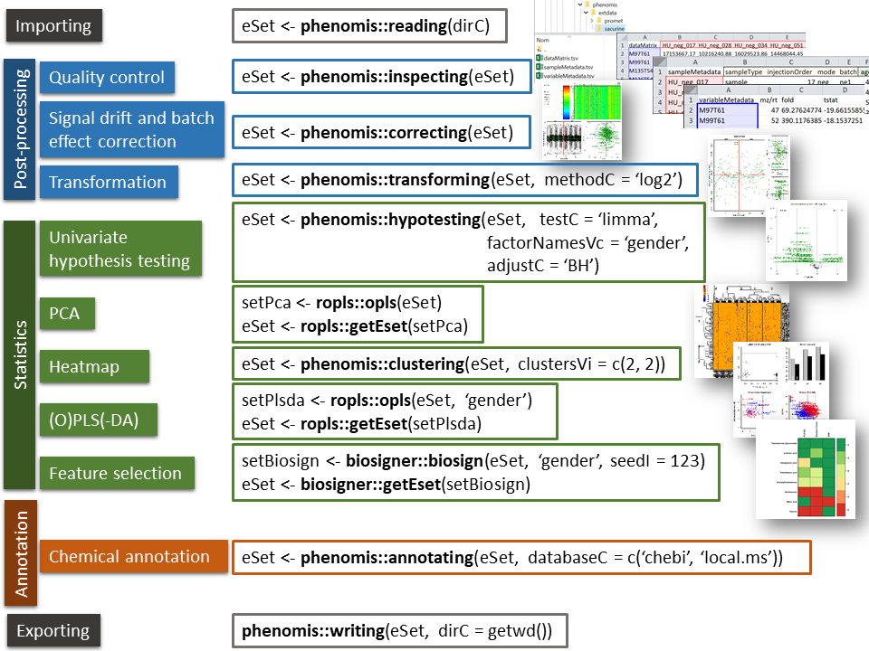
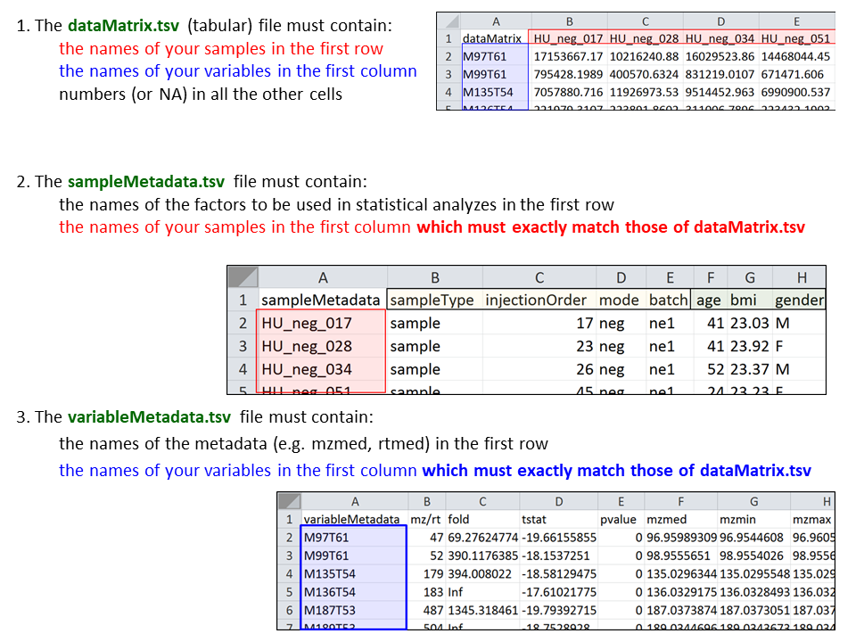

# **phenomis**: An R package for phenotyping data sciences

## Description

This package provides methods to perform the statistical analysis of
phenomics datasets (e.g. in proteomics and metabolomics). These methods
include the reading of datasets (as 3 table *dataMatrix*,
*sampleMetadata* and *variableMetadata* .tsv files) into an
**ExpressionSet** object (**reading**), quality control (**inspecting**)
and transformation (**transforming**) of the dataMatrix, reduction of
chemical redundancy (**reducing**), and univariate hypothesis testing
(**hypotesting**). Multivariate analysis and feature selection can be
further performed with the
[**ropls**](http://bioconductor.org/packages/release/bioc/html/ropls.html)
and
[**biosigner**](http://bioconductor.org/packages/release/bioc/html/biosigner.html)
packages, respectively. Finally, features can be annotated based on
their m/z (and rt) values against public or local databases
(**annotating**; based on the
[**biodb**](https://github.com/pkrog/biodb) package). See the
[**phenomis vignette**](vignettes/phenomis.Rmd) for a detailed example
of the analysis of a metabolomics dataset.

## Contributors

Natacha Lenuzza, Alyssa Imbert, Pierrick Roger, Eric Venot, Sylvain
Dechaumet, and Etienne A. Thevenot.

## Maintainer

Etienne A. Thévenot
([etienne.thevenot\@cea.fr](mailto:etienne.thevenot@cea.fr))
Data Sciences for Molecular Phenotyping and Precision Medicine team
(SciDoPhenIA) Medicines and Healthcare Technologies Department
CEA, INRAE, Paris Saclay University, MetaboHUB
91191 Gif-sur-Yvette Cedex, France
Web: [https://scidophenia.github.io](https://scidophenia.github.io/)

## Methods

## Formats

### 3 tabular file format used for import/export

Input (i.e. preprocessed) data consists of a 'samples times variables'
matrix of intensities (**datMatrix** numeric matrix), in addition to
sample and variable metadata (**sampleMetadata** and
**variableMetadata** data frames). Theses 3 tables can be conveniently
imported to/exported from R as tabular files:

### `SummarizedExperiment`

| **M**ethods                                     | Description                                         | Returned class                    |
|--------------------------|----------------------------|-------------------|
| **Constructors**                                |                                                     |                                   |
| **`SummarizedExperiment`**                      | Create a SummarizedExperiment object                | `SummarizedExperiment`            |
| **`makeSummarizedExperimentFromExpressionSet`** |                                                     | `SummarizedExperiment`            |
| **Accessors**                                   |                                                     |                                   |
| **`assayNames`**                                | Get or set the names of assay() elements            | `matrix`                          |
| **`assay`**                                     | Get or set the ith (default first) assay element    |                                   |
| **`assays`**                                    | Get the list of experimental data numeric matrices  | `SimpleList`                      |
| **`rowData`**                                   | Get or set the row data (features)                  | `DataFrame`                       |
| **`colData`**                                   | Get or set the column data (samples)                | `DataFrame`                       |
| **`metadata`**                                  | Get or set the experiment data                      | `list`                            |
| **`dim`**                                       | Get the dimensions (features of interest x samples) | `integer`                         |
| **`dimnames`**                                  | Get or set the dimension names                      | `list` of length 2 character/NULL |
| **`rownames`**                                  | Get the feature names                               | `character`                       |
| **`colnames`**                                  | Get the sample names                                | `character`                       |

### `MultiAssayExperiment`

([Ramos et al., 2016](https://doi.org/10.1158/0008-5472.CAN-17-0344))

| **M**ethods                | Description                                                          | Returned class           |
|-----------------|--------------------------------------|-----------------|
| **Constructors**           |                                                                      |                          |
| **`MultiAssayExperiment`** | Create a MultiAssayExperiment object                                 | `MultiAssayExperiment`   |
| **`ExperimentList`**       | Create an ExperimentList from a List or list                         | `ExperimentList`         |
| **Accessors**              |                                                                      |                          |
| **`colData`**              | Get or set data that describe the patients/biolgogical units         | `DataFrame`              |
| **`experiments`**          | Get or set the list of experimental data objects as original classes | `experimentList`         |
| **`assays`**               | Get the list of experimental data numeric matrices                   | `SimpleList`             |
| **`assay`**                | Get the first experimental data numeric matrix                       | `matrix`, matrix-like    |
| **`sampleMap`**            | Get or set the map relating observations to subjects                 | `DataFrame`              |
| **`metadata`**             | Get or set additional data descriptions                              | `list`                   |
| **`rownames`**             | Get row names for all experiments                                    | `CharacterList`          |
| **`colnames`**             | Get column names for all experiments                                 | `CharacterList`          |
| **Subsetting**             |                                                                      |                          |
| **`mae[i, j, k]`**         | Get rows, columns, and/or experiments                                | `MultiAssayExperiment`   |
| **`mae[i, ,]`**            | i: GRanges, character, integer, logical, List, list                  | `MultiAssayExperiment`   |
| **`mae[,j,]`**             | j: character, integer, logical, List, list                           | `MultiAssayExperiment`   |
| **`mae[,,k]`**             | k: character, integer, logical                                       | `MultiAssayExperiment`   |
| **`mae[[i]]`**             | Get or set object of arbitrary class from experiments                | (Varies)                 |
| **`mae[[i]]`**             | Character, integer, logical                                          |                          |
| **`mae$column`**           | Get or set colData column                                            | `vector` (varies)        |
| **Management**             |                                                                      |                          |
| **`complete.cases`**       | Identify subjects with complete data in all experiments              | `vector` (logical)       |
| **`duplicated`**           | Identify subjects with replicate observations per experiment         | `list` of `LogicalLists` |
| **`mergeReplicates`**      | Merge replicate observations within each experiment                  | `MultiAssayExperiment`   |
| **`intersectRows`**        | Return features that are present for all experiments                 | `MultiAssayExperiment`   |
| **`intersectColumns`**     | Return subjects with data available for all experiments              | `MultiAssayExperiment`   |
| **`prepMultiAssay`**       | Troubleshoot common problems when constructing main class            | `list`                   |
| **Reshaping**              |                                                                      |                          |
| **`longFormat`**           | Return a long and tidy DataFrame with optional colData columns       | `DataFrame`              |
| **`wideFormat`**           | Create a wide DataFrame, one row per subject                         | `DataFrame`              |
| **Combining**              |                                                                      |                          |
| **`c`**                    | Concatenate an experiment                                            | `MultiAssayExperiment`   |
| **Viewing**                |                                                                      |                          |
| **`upsetSamples`**         | Generalized Venn Diagram analog for sample membership                | `upset`                  |

### **ExpressionSet** and **MultiDataSet** classes

A legacy representation of ID-based datasets, supported for convenience
and supplanted by SummarizedExperiment and MultiAssayExperiment.

Within the R workflow, the **ExpressionSet** class perfectly handles
these 3 tables (for additional information about *ExpressionSet* class,
see the ['An introduction to Biobase and
ExpressionSets'](https://bioconductor.org/packages/release/bioc/vignettes/Biobase/inst/doc/ExpressionSetIntroduction.pdf)
documentation from the
[**Biobase**](https://doi.org/doi:10.18129/B9.bioc.Biobase) package).
The following table describes useful Biobase methods for the handling of
ExpressionSet objects:

| **Biobase** methods    | Description                                                     |
|--------------------|----------------------------------------------------|
| **exprs(eset)**        | 'variable times samples' numeric matrix - dataMatrix            |
| **pData(eset)**        | sample metadata data frame - sampleMetadata                     |
| **fData(eset)**        | variable metadata data frame - variableMetadata                 |
| **sampleNames(eset)**  | sample names                                                    |
| **featureNames(eset)** | variable names                                                  |
| **dims(eset)**         | 2-element numeric vector of 'Features' and 'Samples' dimensions |
| **varLabels(eset)**    | Column names of the sampleMetadata, pData(eset)                 |
| **fvarLabels(eset)**   | Column names of the variableMetadata, fData(eset)               |

### **MultiDataSet** class for multiple datasets

All *phenomis* methods (including *reading* and *writing*) can also be
applied to multiple omics datasets: in this case, the **MultiDataSet**
class is used instead of *ExpressionSet* ([Hernandez-ferrer et al.,
2016](https://doi.org/10.1186/s12859-016-1455-1)).

| **MultiDataSet** methods | Description                                      | Returned class       |
|-------------------|------------------------------------|------------------|
| **mds2mae**              | Convert a MultiDataSet to a MultiAssayExperiment | MultiAssayExperiment |

## Installation

The package can be installed from github with
`devtools::install_github("SciDoPhenIA/phenomis")`.

## Tutorial

See the [**phenomis vignette**](vignettes/phenomis.Rmd) for a detailed
example of the analysis of a metabolomics dataset.

## Please cite

-   Imbert, A., Rompais, M., Selloum, M., Castelli, F., Mouton-Barbosa,
    E., Brandolini-Bunlon, M., Chu-Van, E., Joly, C., Hirschler, A.,
    Roger, P., Burger, T., Leblanc, S., Sorg, T., Ouzia, S.,
    Vandenbrouck, Y., Médigue, C., Junot, C., Ferro, M., Pujos-Guillot,
    E., de Peredo, A. G., Fenaille, F., Carapito, C., Herault, Y., &
    Thévenot, E. A. (2021). ProMetIS, deep phenotyping of mouse models
    by combined proteomics and metabolomics analysis. *Scientific Data*,
    8(1).
    [doi:10.1038/s41597-021-01095-3](https://doi.org/10.1038/s41597-021-01095-3)

-   Thévenot, E.A., Roux, A., Xu, Y., Ezan, E., and Junot, C. (2015).
    Analysis of the human adult urinary metabolome variations with age,
    body mass index and gender by implementing a comprehensive workflow
    for univariate and OPLS statistical analyses. *Journal of Proteome
    Research* 14, 3322--3335.
    [doi:10.1021/acs.jproteome.5b00354](https://doi.org/10.1021/acs.jproteome.5b00354)

## Funding

-   [CEA](http://www.cea.fr/english)
-   [INRAE](https://www.inrae.fr/en)
-   [MetaboHUB](https://www.metabohub.fr/home.html) [ANR-11-INBS-0010]
